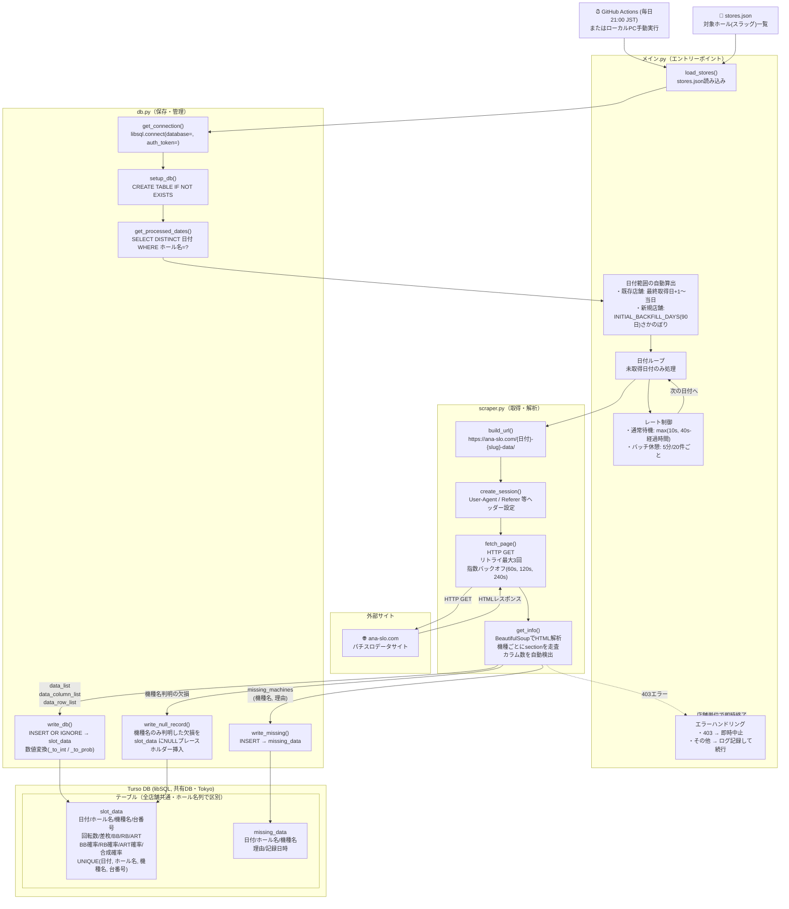

# 構成図 — 要件定義 1「データ収集」

## システム構成図

---

## 処理フロー補足

| フェーズ | 処理 | 担当モジュール |
|---|---|---|
| ① 店舗一覧読み込み | `stores.json`から対象ホール一覧を取得 | `メイン.py.load_stores` |
| ② DB初期化 | テーブル作成（`IF NOT EXISTS`） | `db.setup_db` |
| ③ 日付範囲算出 | 店舗ごとに最終取得日+1〜当日を自動算出（新規店舗は90日バックフィル） | `メイン.py.process_store` + `db.get_processed_dates` |
| ④ URL構築 | `https://ana-slo.com/{日付}-{slug}-data/` | `scraper.build_url` |
| ⑤ HTTP取得 | リトライ3回・指数バックオフ・SSL対応 | `scraper.fetch_page` |
| ⑥ HTML解析 | section単位でカラム数自動検出・台データ抽出 | `scraper.get_info` |
| ⑦ データ保存 | 正常データ → `slot_data`、欠損 → `missing_data`（Turso DBへ） | `db.write_db` / `write_missing` / `write_null_record` |
| ⑧ レート制御 | 通常10〜40秒待機、20件ごとに5分休憩 | `メイン.py` |

---

## DBスキーマ詳細

### slot_data テーブル

| カラム | 型 | 備考 |
|---|---|---|
| 日付 | TEXT | YYYY-MM-DD |
| ホール名 | TEXT | URLスラッグ |
| 機種名 | TEXT | |
| 台番号 | INTEGER | |
| 回転数 | INTEGER | カンマ除去して保存 |
| 差枚 | INTEGER | 符号付き（+/−）・カンマ除去 |
| BB / RB / ART | INTEGER | ART非搭載機種はNULL |
| BB確率 / RB確率 / ART確率 / 合成確率 | REAL | `1/xxx` → `1÷xxx` の実数。分母0はNULL |

- UNIQUE制約: `(日付, ホール名, 機種名, 台番号)`

### missing_data テーブル

| カラム | 型 | 備考 |
|---|---|---|
| 日付 | TEXT | |
| ホール名 | TEXT | |
| 機種名 | TEXT | ホール全体欠損時はNULL |
| 理由 | TEXT | `'ページにデータなし'` / `'カラム数特定不可'` |
| 記録日時 | TEXT | 自動付与 |

---

## Stage A移行済み（2026-07）

上記の構成図はStage A移行後（現状）のもの。移行前との差分は以下の通り。

- `ユーザー入力`（開始日・終了日・店舗URL）→ `stores.json`読み込み＋前回取得済み日の翌日〜当日の自動算出（無人実行対応）
- `db.py`の保存先 → ローカルSQLite（`ホールデータ/{ホール名}.db`、店舗ごとにファイル分離）→ クラウドDB「Turso」（libSQL/SQLite互換、Tokyo）に全店舗共有の1DBとして統合
- 実行主体 → ローカルPCでの手動実行に加え、GitHub Actionsの定期実行（毎日21:00 JST）を追加（PC手動実行は廃止しない）
- 既存の蓄積データ（5店舗・計291,979件）は`merge_stores_for_turso.py`で統合しTurso Upload DBで移行済み

詳細は[`fase1/データ収集_skill.md`](データ収集_skill.md)「Stage A移行（実装済み・2026-07）」、[`要件定義.md`](../要件定義.md)「3. 配信・公開」参照。
