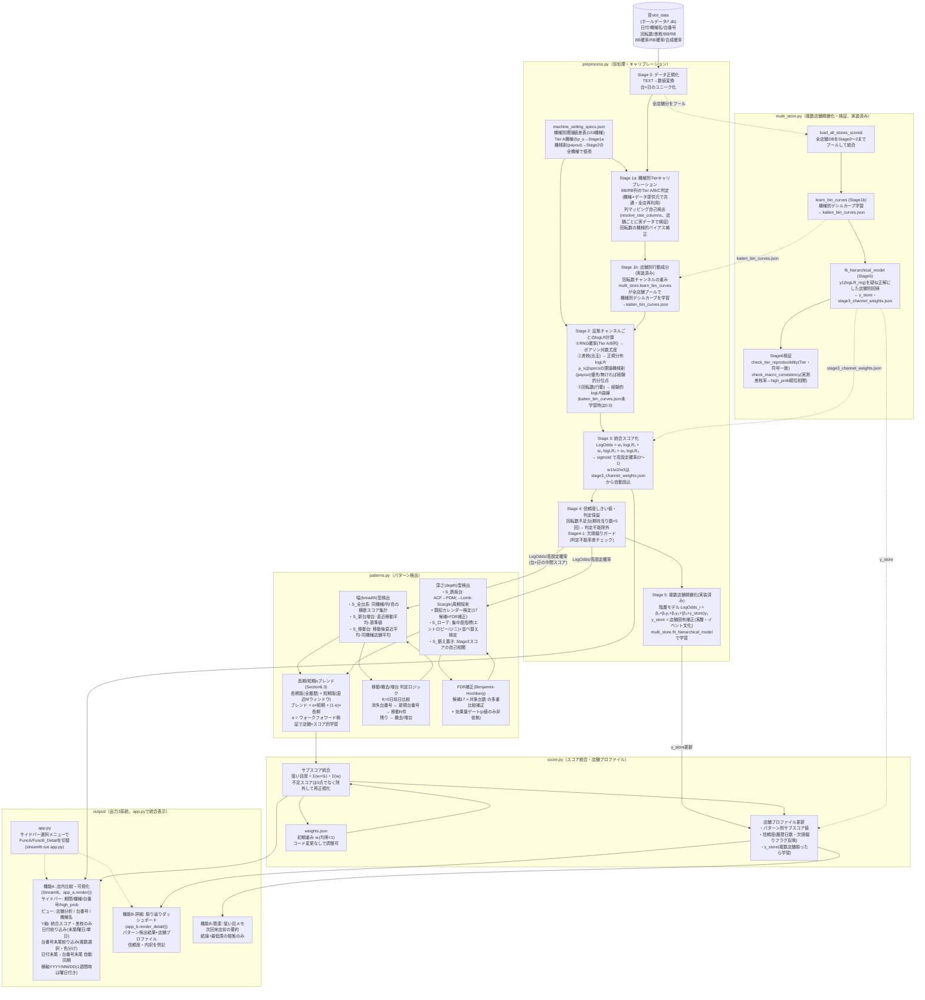

# 構成図 — 要件定義 2「設定推測・パターン分析」

## システム構成図



> **(検討中・未実装)店舗×日 高設定台数上限キャリブレーション**: Stage4出力(score.pyが店舗プロファイルに書き込む直前)に、店舗全体のE[high_prob]/Nが動的上限を超えた場合にソフトシュリンクする後処理を挿入する案。Stage5(γ_store)の正則化として位置づけ、multi_store.py構築後はKalman filterで上限自体を逐次推定する(Step2)。実装見送りの前提条件だった回転数チャンネル(w3)未有効化は2026-07に`multi_store.py`実装(Stage1b/5)で解消済み。本キャリブレーション自体は引き続き未着手(詳細: [`データ分析_skill.md`](データ分析_skill.md)「長期/短期αブレンド」直後・[`追加検討 店舗高設定上限モデル.md`](追加検討%20店舗高設定上限モデル.md))。

> **(検討中・未実装)機能B再設計**: `FuncB_Detail`/`FuncB_Simple`を、トップページ(当日・翌日ランキングを1軸で強い店/弱い店とも表示)・店舗プロファイル拡張(パターン別強さ/弱さ・検知期間履歴・当月カレンダーヒートマップ)へ拡張する方針を2026-07に議論・確定(実装未着手)。`SubScore`(狙い目度)は符号付きスコアに拡張し、新規`pattern_history`テーブル(append-only)を`StoreProfile`と並行して追加する。詳細: [`追加検討_機能B再設計.md`](追加検討_機能B再設計.md)。

---

## 処理フロー補足

| フェーズ | 処理 | 担当モジュール |
|---|---|---|
| ① 正規化 | TEXT→数値変換・台×日ユニーク化 | `preprocess.Stage0` |
| ② Tier判定 | BB/RB列の信頼性分類(A/B/C)・列マッピング自己検出(店舗ごとの実列検証)・回転数バイアス補正 | `preprocess.Stage1a` |
| ③ logLR計算 | 3チャンネル(RNG/差枚/回転数)ごとに対数尤度比を算出 | `preprocess.Stage2` |
| ④ 統合スコア | weighted LogOdds → sigmoid → 高設定確率 | `preprocess.Stage3` |
| ⑤ 判定保留 | 回転数不足台の除外・欠損偏りガード | `preprocess.Stage4` |
| ⑥ パターン検出 | 幅型(全台系/新台増台/移動台)・深さ型(鉄板台/ローテ/据え置き) | `patterns.py` |
| ⑦ αブレンド | 長期版・短期版サブスコアを学習的重みαで合成 | `patterns.blend` |
| ⑧ スコア統合 | Σ(wᵢ×Sᵢ)÷Σ(wᵢ)、不足スコアは除外 | `score.py` |
| ⑨ 店舗プロファイル更新 | サブスコア・信頼度・γ_storeを再計算して保存 | `score.py` |
| ⑩ 出力 | 機能A(可視化)/機能B-詳細/機能B-簡潔。app.pyのサイドバー選択で1ページに統合表示 | `output/` |
| ①〜⑨一括実行(1店舗分) | ①〜⑨を通しで実行しstore_profileを作成・更新するバッチ | `run_store_profile.py` |
| Stage1b/5/6(複数店舗) | 全店舗データをプールしてbin_curves・γ_store・βを学習、Tier再現性/マクロ整合性を検証 | `multi_store.py` |

---

## 台同一性・移動検出ロジック

```
店舗×機種名で D-1 と D を比較:
  消失台番号 = D-1に存在しDに存在しない台番号
  新規台番号 = D-1に存在せずDに存在する台番号
  N = min(len(消失), len(新規))
  → N件を「移動」(S_移動台の対象) として扱う
  → 消失の残り = 撤去
  → 新規の残り = 増台(S_新台増台の対象)
```

- 号機(実機固有ID)は**取得不可・確定**。同一性キー = (機種名, 台番号)
- 台番号変化で系列リセット(鉄板台・据え置きの自己相関履歴も含む)
- 同型入替の検知は**対象外(既知の制約)**

---

## サブスコア一覧

| サブスコア | 系統 | 入力の実体 | データ不足時 | αブレンド |
|---|---|---|---|---|
| S_全台系 | 幅 | Stage3スコアの当日横断集計 | 除外 | ◯ |
| S_鉄板台 | 深さ | Stage3スコアの縦断履歴(台単位) | 除外 | ◯ |
| S_ローテ | 深さ | Stage3スコアの縦断履歴(機種/列単位) | 除外 | ◯ |
| S_新台増台 | 幅 | Stage3スコアの移動平均(増台後) | 除外 | — |
| S_移動台 | 幅 | Stage3スコアの移動平均(移動後) | 除外 | — |
| S_据え置き | 深さ | Stage3スコアの自己相関 | 除外 | ◯ |
| S_稼働低さ | 店舗全体 | 店舗全体の回転数集計(Section7) | 除外 | — |

---

## DBスキーマ(入力・fase1から引き継ぎ)

### slot_data テーブル(読み取り専用)

| カラム | 型 | 備考 |
|---|---|---|
| 日付 | TEXT | YYYY-MM-DD |
| ホール名 | TEXT | URLスラッグ |
| 機種名 | TEXT | |
| 台番号 | INTEGER | |
| 回転数 | INTEGER | |
| 差枚 | INTEGER | 符号付き |
| BB / RB / ART | INTEGER | ART列は多くの店舗で全行NULLだが、店舗によってはBB相当のデータがART列に入る(resolve_rate_columnsが吸収) |
| BB確率 / RB確率 / ART確率 / 合成確率 | REAL | 1/xxx → 実数変換済み |

### 派生データ(fase2で新規追加)

| テーブル / ファイル | 内容 |
|---|---|
| `stage3_scores` テーブル | 台×日ごとのLogOdds・高設定確率・判定不能フラグ |
| `store_profile` テーブル | 店舗×パターンのサブスコア・信頼度・γ_store・更新日時。`run_store_profile.py`で作成・更新(未実行の店舗はテーブル自体が無く機能Bに表示されない)。(検討中)上限キャリブレーション実装時は「上限キャリブレーション値」「上限信頼度」カラムを追加候補(未実装) |
| (検討中・未実装)`pattern_history` テーブル | 機能B再設計([`追加検討_機能B再設計.md`](追加検討_機能B再設計.md))で追加予定。`store_profile`と異なりappend-onlyで検知期間履歴を蓄積し、将来の予測精度自己検証(Stage7)のバックテストに使う |
| `machine_setting_specs.json` | 機種別理論値差表。全機種にBB/RB/機械割(payout)を格納。BB/RBはTier A機種のみp_sとしてStage1aで使用、機械割(payout)は全機種でStage2差枚チャンネルのμ_sとして使用(店舗単位の一律補正は入れない、理由は`データ分析_skill.md`参照)。`scrape_machine_specs.py`(chonborista.comから収集)→`assign_tier.py`(Tier判定・正規化)で生成 |
| `raw_specs_scraped.json` | `scrape_machine_specs.py`が取得した生データ(machine_setting_specs.json生成前の中間ファイル) |
| `weights.json` | サブスコアの重み wᵢ(コード変更なしで調整可) |
| `kaiten_bin_curves.json` | Stage1b(`multi_store.learn_bin_curves`)が全店舗データから学習した機種別デシルカーブ。`preprocess.compute_all_logLR`が自動読込 |
| `stage3_channel_weights.json` | Stage5(`multi_store.fit_hierarchical_model`)が学習したチャンネル重み{b0,b1,b2,b3}。`preprocess.compute_log_odds`が自動読込 |
